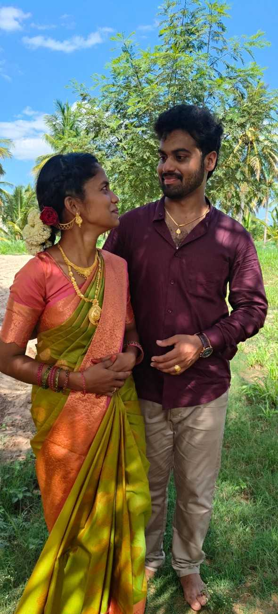
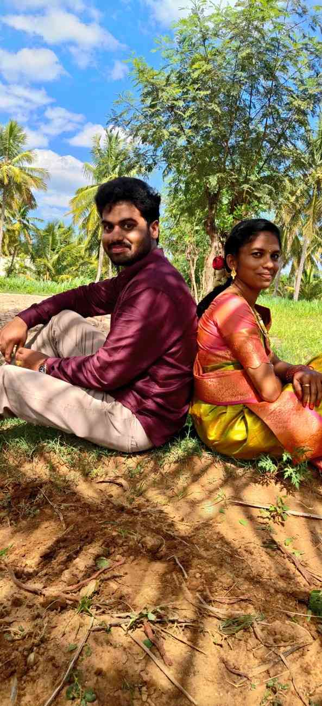
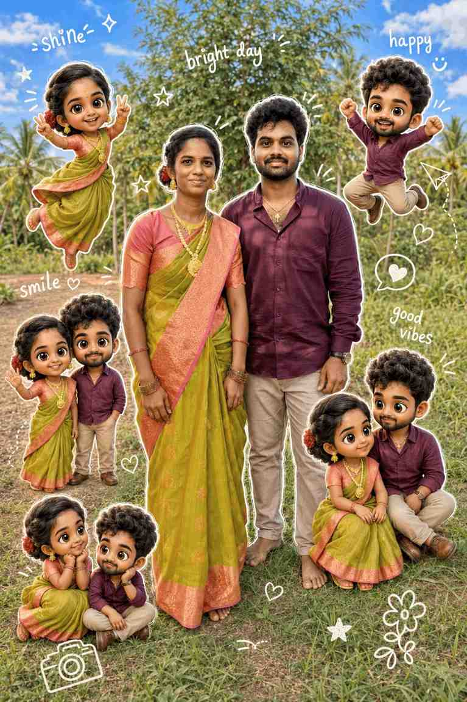
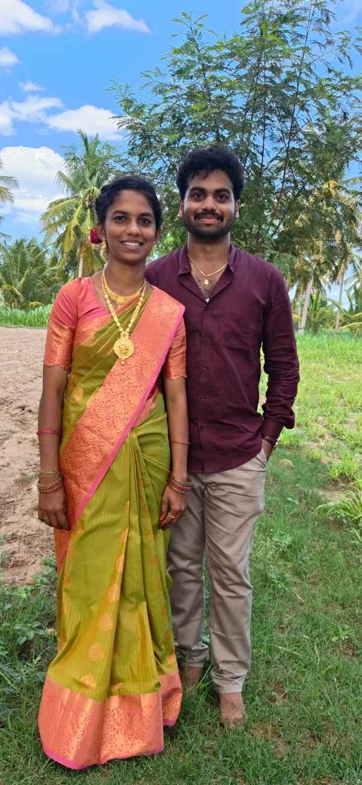

<!DOCTYPE html>
<html lang="en">
<head>
  <meta charset="UTF-8">
  <meta name="viewport" content="width=device-width, initial-scale=1.0">
  <title>Naveenkumar M & Pavithra C Wedding Invitation</title>

  <link href="https://cdn.jsdelivr.net/npm/bootstrap@5.3.3/dist/css/bootstrap.min.css" rel="stylesheet">
  <link href="https://fonts.googleapis.com/css2?family=Sacramento&family=Poppins:wght@300;400;600;700&display=swap" rel="stylesheet">

  
</head>

<body>
  <audio id="bgMusic" loop preload="auto">
    <source src="music.mp3" type="audio/mpeg">
  </audio>

  <section class="hero">
    

      <h5>With The Blessings Of Our Families</h5>
      <h1>Naveenkumar M  &amp; Pavithra C</h1>
      
25 June 2026 &bull; 4:30 AM - 6:00 AM

      <button id="openBtn" class="btn btn-gold btn-lg" type="button">
        Open Invitation
      </button>
    

  </section>

  <section id="invite" class="container py-5">
    <h2 class="section-title text-center">Groom &amp; Bride</h2>
    

      

        

          <h3>M. Naveenkumar</h3>
          
Beloved Son of D. Murugan &amp; Salammal

        

      

      

        

          <h3>C. Pavithra</h3>
          
Beloved Daughter of Chinnaraj &amp; Nagamani

        

      

    

  </section>

  <section class="container py-5 text-center">
    <h2 class="section-title">Countdown</h2>
    

      

        

          
0

          
Days

        

      

      

        

          
0

          
Hours

        

      

      

        

          
0

          
Minutes

        

      

      

        

          
0

          
Seconds

        

      

    

  </section>

  <section class="container py-5">
    <h2 class="section-title text-center">Events</h2>

    

      <h3>Reception</h3>
      
24 June 2026 &bull; 6:30 PM Onwards

      
SSR Mandapam &amp; Marriage Hall

      <a class="btn btn-warning" target="_blank" rel="noopener" href="https://maps.app.goo.gl/393FdVEkab77JVGS8">View Location</a>
    

    

      <h3>Wedding Ceremony</h3>
      
25 June 2026 &bull; 4:30 AM - 6:00 AM

      
SSR Mandapam &amp; Marriage Hall

      <a class="btn btn-warning" target="_blank" rel="noopener" href="https://maps.app.goo.gl/393FdVEkab77JVGS8">View Location</a>
    

  </section>

  <section class="container py-5">
    <h2 class="section-title text-center">Gallery</h2>

    

      

        

          
          

            <h5>Naveenkumar &amp; Pavithra</h5>
          

        

        

          
          

            <h5>With Love and Blessings</h5>
          

        

        

          
          

            <h5>Save The Date</h5>
          

        

        

          
          

            <h5>Join Our Celebration</h5>
          

        

        

          
          

            <h5>Forever Begins Here</h5>
          

        

      

      

    

  </section>

  <section class="container py-5 text-center">
    

      With the blessings of our parents and elders, we warmly invite you to celebrate our wedding.
      Your presence and blessings will make our special day even more memorable.
    

  </section>

  <footer class="footer">
    <h2>Save The Date</h2>
    
Naveenkumar M &hearts; Pavithra C

    
Reception: 24 June 2026

    
Wedding: 25 June 2026

  </footer>

  

  
</body>
</html>
